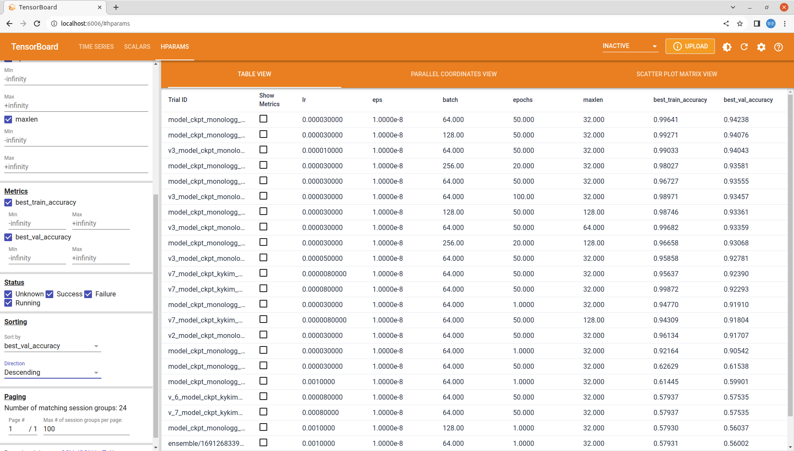

# HAI_Kaggle_Competition
*updated at 2023.08.14*

## Link

---

- [캐글 링크](https://www.kaggle.com/competitions/hai2023summer)
  - 이 competition은 HAI 2023년 ML 모델링 과제를 위한 것으로, 한국어 지역 방언 분류를 목표로 합니다.
  - 참가자들은 입력된 구어체 텍스트를 표준어와 경상도, 제주도 방언 중 하나로 분류하는 모델을 개발해야 합니다.
- [블로그 링크](https://dorae222.tistory.com/category/HAI%20-%20%EA%B5%90%EB%82%B4%20%EB%8F%99%EC%95%84%EB%A6%AC/Kaggle_%ED%95%9C%EA%B5%AD%20%EB%B0%A9%EC%96%B8%20%EB%B6%84%EB%A5%98%28%EC%97%AC%EB%A6%84%20%EB%B0%A9%ED%95%99%29?page=1)
  - 이번 대회를 진행하면서 기존에 진행했던 실험방식과 더불어, 실험 설계와 과정을 기록하였습니다.
  - *아직 내용을 전부 정리하지는 못했습니다.*
  - 자세한 내용은 블로그 참고 부탁드립니다.

## Result

---

- 실험 결과

     
    (2023.08.14)

